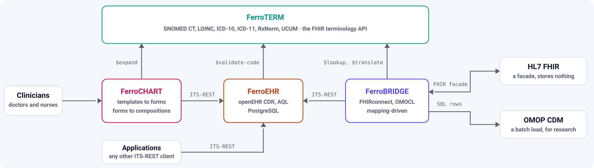

<!-- SPDX-FileCopyrightText: Ruben Talstra -->
<!-- SPDX-License-Identifier: Apache-2.0 -->

# 

[](https://github.com/rubentalstra/FerroHEALTH/actions/workflows/pages.yml)
[](LICENSE)

The family site for three pure-Rust health-data servers, published at
**<https://ferrohealth.eu/>**. This repository holds the site and the shared
brand; it holds no product code.

| Product | Does | Site |
|---|---|---|
| [FerroEHR](https://github.com/rubentalstra/FerroEHR) | An openEHR Clinical Data Repository: stores and queries the record | <https://ferroehr.eu/> |
| [FerroTERM](https://github.com/rubentalstra/FerroTERM) | An HL7 FHIR terminology server: answers what a code means | <https://ferroterm.eu/> |
| [FerroBRIDGE](https://github.com/rubentalstra/FerroBRIDGE) | A bridge from openEHR to FHIR and to the OMOP CDM: carries the record onward | <https://ferrobridge.eu/> |

Each product is released from its own repository under the Business Source
License 1.1, documents itself on its own domain, and runs without the other
two. This site says how they fit together and nothing a product's own site
should say instead.



The diagram is one file, reusable anywhere:
[`assets/diagrams/README.md`](assets/diagrams/README.md) says how.

## Layout

```
assets/brand/              the FerroHEALTH mark, lockups, favicons, social card, palette
assets/diagrams/           the architecture diagram, self-contained and theme-adaptive
website/landing/           the site: one page, its stylesheet, and its static files
  assets/products/         a copy of each product's own mark, for the product cards
scripts/site/assemble.sh   builds the site the way GitHub Pages serves it
scripts/checks/            what CI runs against the assembled site
.github/workflows/pages.yml  build on every push and pull request, deploy from main
```

## Build it

```bash
scripts/site/assemble.sh _site        # assemble into _site/
scripts/checks/internal-links.sh _site  # every local link resolves
python3 -m http.server -d _site 8000  # then open http://localhost:8000/
```

`assemble.sh` copies the landing directory and the brand directory into one
tree, and renders two things:

- the release column of the status table and the container tag in the quick
  start, from each product's latest release through the GitHub API. Without a
  token the page keeps the version committed in `index.html`, which is a real
  release and is exactly as stale as the checkout.
- `sitemap.xml`'s `lastmod`, from the commit being deployed.

## How it is deployed

GitHub's Pages-with-Actions pattern, the same one the three product
repositories use. A push to `main` assembles the site and deploys it; a pull
request assembles it and stops. A daily schedule redeploys, so a release cut in
any of the three products reaches the status table without a commit here.

The custom domain is configured in the repository's Pages settings, and
`website/landing/CNAME` travels with the artifact so the domain survives a
switch back to branch-based publishing.

## Conventions worth keeping

- **No external request at load time.** The page's CSP is `default-src 'self'`.
  That is why each product's mark is a committed copy under
  `website/landing/assets/products/`, and why there is no web font, no
  analytics, and no CDN.
- **No hand-typed version.** A number that describes a product is rendered from
  that product's release, never typed into the page and left to rot.
- **The parent owns no hue.** FerroEHR is rust, FerroTERM is teal, FerroBRIDGE
  is indigo; FerroHEALTH is iron and steel, and borrows the three only where a
  product is named. See [`assets/brand/README.md`](assets/brand/README.md).

## Licence

The site, the scripts and the FerroHEALTH brand assets in this repository are
[Apache-2.0](LICENSE). Each product's mark under
`website/landing/assets/products/` belongs to that project and keeps its
licence. The products themselves are BUSL-1.1, with the parameters that apply
in each repository's own licence file:
[FerroEHR](https://github.com/rubentalstra/FerroEHR/blob/main/LICENSE),
[FerroTERM](https://github.com/rubentalstra/FerroTERM/blob/main/LICENSE),
[FerroBRIDGE](https://github.com/rubentalstra/FerroBRIDGE/blob/main/LICENSE).
The site states what those terms mean at
<https://ferrohealth.eu/#licensing>.

openEHR® is a registered trademark of the openEHR Foundation. HL7® and FHIR®
are registered trademarks of Health Level Seven International. SNOMED CT® is a
registered trademark of SNOMED International. None of these organisations
endorse FerroHEALTH.
